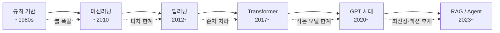
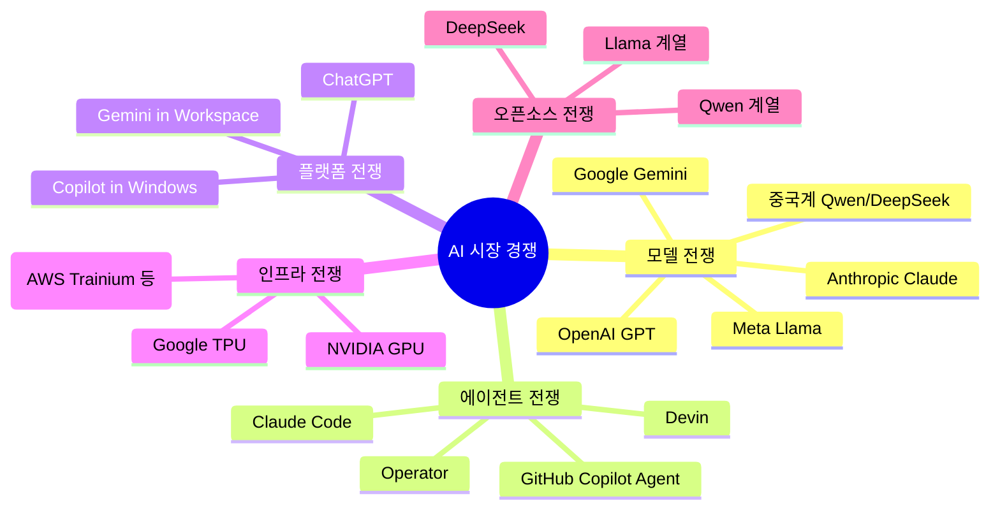
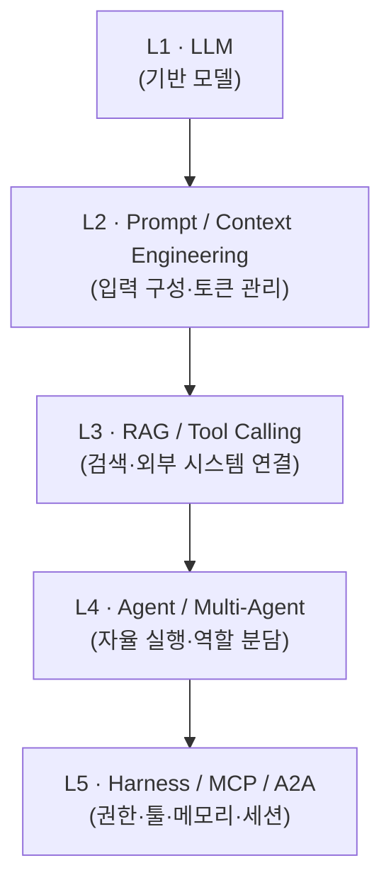
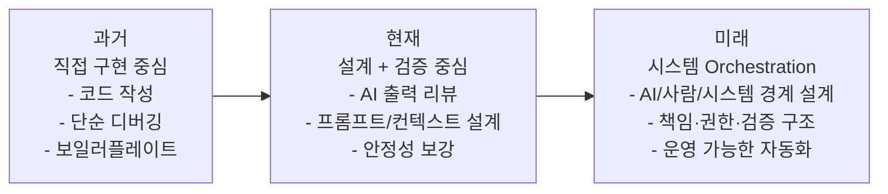

# AI 기술 등장 배경과 구조적 변화 분석

> 스터디 1회차 · 2026-05-30 · 발표자 kodayoung
> 대상: IT 업계 종사자 / 개발자
> 관점: Backend / 시스템 운영 / 개발 워크플로우 변화

## TL;DR

- AI 폭발은 단일 발명이 아니라 **GPU·데이터·Transformer·클라우드** 4요소가 동시에 성숙한 결과다.
- AI 역사는 **직전 시대의 한계를 해결하며 새로운 비용과 리스크를 만들어 온 흐름**이다.
- 현재 시장은 단순 모델 경쟁이 아니라 **컴퓨팅 인터페이스 장악 경쟁**(모델·에이전트·플랫폼·인프라·오픈소스)이다.
- AI-Native 시대의 경쟁력은 모델이 아니라 **Context·Validation·Permission·Orchestration·Observability를 갖춘 실행 환경**이다.
- 개발자의 일은 "직접 구현"에서 **"설계 + 검증 + AI 오케스트레이션"** 으로 이동 중이다.

## 목차

- [AI 기술 등장 배경과 구조적 변화 분석](#ai-기술-등장-배경과-구조적-변화-분석)
  - [TL;DR](#tldr)
  - [목차](#목차)
  - [1️⃣ 왜 지금 AI가 폭발했는가](#1️⃣-왜-지금-ai가-폭발했는가)
  - [2️⃣ AI 역사 흐름](#2️⃣-ai-역사-흐름)
    - [시대별 비교](#시대별-비교)
  - [3️⃣ 현재 AI 산업 브리핑](#3️⃣-현재-ai-산업-브리핑)
    - [진영별 방향성](#진영별-방향성)
  - [4️⃣ AI-Native 기술의 등장](#4️⃣-ai-native-기술의-등장)
    - [실행 환경의 핵심 구성](#실행-환경의-핵심-구성)
  - [5️⃣ 미래와 개발자의 역할](#5️⃣-미래와-개발자의-역할)
    - [현실에서 일어나는 문제들](#현실에서-일어나는-문제들)
    - [사라지는 일 vs 늘어나는 일](#사라지는-일-vs-늘어나는-일)
  - [References](#references)

## 1️⃣ 왜 지금 AI가 폭발했는가

**핵심 메시지: AI 폭발은 알고리즘 혁신 + 인프라 혁신 + 데이터 폭증이 동시에 정렬된 결과다.**

LLM은 어느 날 갑자기 등장한 기술이 아니다. 2010년대 중반까지 딥러닝 자체는 이미 존재했지만, 실제 상용화가 가능해진 것은 다음 네 가지 조건이 같은 시기에 충족되었기 때문이다.

| 요소 | 무엇이 변했나 | 결과 |
| --- | --- | --- |
| GPU | CUDA 기반 범용 연산 → A100/H100, 대규모 분산 학습 | 단일 모델 학습 시간이 수년 → 수주 |
| 데이터 | 인터넷·코드·서적 등 학습 가능한 텍스트가 수십 TB 규모로 축적 | scale에 의한 능력 발현 가능 |
| Transformer (2017) | RNN의 순차 처리 한계 → Self-Attention 기반 병렬 학습 | 학습 throughput과 모델 크기 동시 확장 |
| 클라우드 인프라 | 수천 GPU 클러스터를 임대 가능 | 빅테크 외부에서도 frontier 학습 시도 가능 |

운영 관점에서 가장 중요한 변화는 **"비용 곡선이 비로소 비즈니스 가능 영역으로 내려왔다"** 는 점이다. 같은 모델을 2015년에 학습했다면 비용은 100배 이상, 추론 지연은 수십 배 이상이었을 것이다.

## 2️⃣ AI 역사 흐름

**핵심 메시지: AI는 실패를 개선하며 진화해 온 역사다. 모든 시대는 이전 시대의 한계에서 시작했고, 새로운 비용과 리스크를 만들었다.**

### 시대별 비교

| 시대 | Why (이전 한계) | What (변화) | 살아남은 핵심 기술 | 주요 이슈 |
| --- | --- | --- | --- | --- |
| **규칙 기반** | 인간 패턴을 코드로 자동화 | If-Then 룰엔진, Expert System | 비즈니스 룰 엔진, 정책 엔진 (지금도 사기탐지·컴플라이언스에서 사용) | 룰 폭발, 유지보수 불가 |
| **머신러닝** | 룰을 사람이 다 못 씀 → 데이터로 학습 | 통계 학습 (SVM, RF, GBM) | scikit-learn, feature engineering, 추천 시스템 | 피처 엔지니어링 비용, 도메인 의존 |
| **딥러닝** | 피처를 사람이 못 만듦 → 표현 학습 | CNN/RNN, end-to-end 학습 | GPU 학습, embedding | 데이터 의존, 해석성 부족 |
| **Transformer** | RNN의 장거리 의존성·병렬화 한계 | Self-Attention 기반 병렬 학습 | self-attention, scaling laws, encoder/decoder | 학습 비용 폭발 |
| **GPT 시대** | 작은 모델로는 범용성 불가 → scale | 대규모 사전학습 + 프롬프트 | LLM, few-shot, instruction tuning, RLHF | 환각, 토큰 비용, 안전성 |
| **RAG / Agent** | LLM은 최신·사실·실행 불가 | 외부 컨텍스트 주입 + Tool 실행 | Vector DB, Tool Calling, Memory, Orchestration | 검증, 신뢰성, 보안 |

각 전환점에는 공통 패턴이 있다.

1. 이전 방식이 **scale에 의해 무너졌다**.
2. 다음 방식은 **새로운 종류의 비용(GPU, 데이터, 인프라, 운영)** 을 요구했다.
3. 살아남은 기술은 사라지지 않고 **현재 스택의 하부 레이어로 흡수되었다.** (룰엔진은 여전히 정책 검증에, ML은 여전히 추천에 쓰인다.)

## 3️⃣ 현재 AI 산업 브리핑

**핵심 메시지: 현재 AI 시장은 모델 성능 경쟁이 아니라, "미래 컴퓨팅 인터페이스를 누가 장악할 것인가" 의 경쟁이다.**

### 진영별 방향성

| 진영 | 핵심 전략 | 무엇을 장악하려 하는가 |
| --- | --- | --- |
| **OpenAI** | ChatGPT를 컨슈머 진입점화 | AI 사용자 플랫폼 (검색·앱·결제) |
| **Anthropic** | 안전성·코딩·Enterprise 업무 | 개발자 워크플로우와 기업 도입 |
| **Google** | Gemini를 검색·Workspace·Android에 통합 | 기존 자산(검색·OS·문서)과의 결합 |
| **Meta** | Llama 오픈 가중치 | 생태계 표준 + 자사 광고/서비스 데이터 |
| **중국계 (Qwen/DeepSeek/GLM 등)** | 비용 효율·자국 주권 | 가격대와 규제 회피, 자체 클라우드 통합 |

운영 관점에서 모델 선택은 단순 벤치마크 비교가 아니다. **데이터 거버넌스(국외 반출/사적 정보 처리), 비용 곡선(토큰 단가 및 캐싱), 락인(Vendor lock-in)** 이 더 중요한 기준이 되고 있다.

> 참고: "어느 모델이 가장 좋은가"는 빠르게 무의미해지고 있다. 6개월 단위로 순위가 뒤바뀌며, 같은 모델도 도메인별(코드/추론/한국어/문서)로 강약이 크다. **선택보다 교체 가능성(모델 abstraction)이 더 중요한 아키텍처 결정**이다.

## 4️⃣ AI-Native 기술의 등장

**핵심 메시지: AI 발전은 모델뿐 아니라 시스템 엔지니어링의 역사이기도 하다. 좋은 모델보다 좋은 실행 환경이 더 큰 차이를 만든다.**

2023년 이후의 발전은 모델 크기 증가에서 **"모델을 어떻게 실행할 것인가"** 로 이동했다. 같은 모델이라도 실행 환경에 따라 결과 품질·비용·안정성이 크게 갈린다.

### 실행 환경의 핵심 구성

| 구성 요소 | 역할 | 운영에서 자주 생기는 이슈 |
| --- | --- | --- |
| Context 관리 | 무엇을, 어떤 순서로, 얼마나 넣을지 | 토큰 초과, 관련성 낮은 문서 주입 |
| Validation | 출력 스키마·사실 검증 | JSON 파싱 실패, 환각된 사실 |
| Retry | 실패 시 재시도·백오프 | 무한 루프, 비용 누적 |
| Permission | tool 실행 권한·사용자 승인 | 의도하지 않은 액션, 데이터 유출 |
| Orchestration | 다단계 / 다중 에이전트 흐름 | 상태 관리, 중간 실패 복구 |
| Observability | trace, log, eval | 무엇이 왜 실패했는지 추적 불가 |

운영 관점에서 AI feature 출시는 더 이상 "프롬프트 잘 짜는 일"이 아니다. **SRE·플랫폼 엔지니어링 수준의 시스템 설계가 필요**하다. 특히 Permission과 Observability가 부재하면, 작동은 하지만 사고 시 원인 추적이 불가능한 시스템이 만들어진다.

> 참고: MCP(Model Context Protocol), A2A(Agent-to-Agent) 같은 프로토콜은 표준화가 진행 중이지만 아직 합의된 단계는 아니다. 표준 채택 여부보다 **인터페이스 추상화 자체를 운영 가능한 수준으로 구현**하는 것이 우선이다.

## 5️⃣ 미래와 개발자의 역할

**핵심 메시지: 개발자의 일은 "직접 구현"에서 "AI와 협업 가능한 시스템 설계"로 이동한다. 사라지는 일은 보일러플레이트이고, 늘어나는 일은 검증과 의사결정이다.**

### 현실에서 일어나는 문제들

| 영역 | 문제 |
| --- | --- |
| 보안 | 프롬프트 인젝션, 학습 데이터 유출, 코드에 포함된 비밀키 자동 커밋 |
| 비용 | 토큰 단가, 반복 호출 누적, 캐시 미스 |
| 사고력 저하 | AI 출력을 검증 없이 수용 → 근본 원인 파악 능력 약화 |
| 의존성 | 특정 모델·벤더에 락인된 워크플로우 |
| 검증 | 환각 / 부분적 오답 / 미세한 사실 오류의 누락 |

### 사라지는 일 vs 늘어나는 일

- **줄어드는 일**: 단순 CRUD, 보일러플레이트, 첫 응답 작성, 1차 검색
- **늘어나는 일**: 시스템 설계, trade-off 의사결정, AI 출력 검증, 사고 시 원인 분석, 권한·책임 구조 설계

> 참고: "AI가 OS가 된다"는 주장은 speculative하다. 현재 AI는 OS의 일부 인터페이스(자연어 검색·실행)를 대체하고 있지만, 권한·파일시스템·하드웨어 추상화 같은 OS의 핵심 기능을 대체하지는 못한다. AI를 **새로운 종류의 애플리케이션 레이어**로 보는 편이 운영 설계에 가깝다.

개발자에게 남는 본질적 능력은 **"무엇을 만들어야 하는지 정의하고, 만들어진 것이 옳은지 검증하고, 그 책임을 질 수 있는 능력"** 이다. 이 부분은 모델이 좋아질수록 오히려 더 중요해진다.

---

## References

- Vaswani et al., *Attention Is All You Need* (2017)
- Brown et al., *Language Models are Few-Shot Learners* (GPT-3, 2020)
- Lewis et al., *Retrieval-Augmented Generation for Knowledge-Intensive NLP Tasks* (2020)
- Ouyang et al., *Training language models to follow instructions with human feedback* (InstructGPT / RLHF, 2022)
- Andrej Karpathy, *Software 2.0* (2017) / 후속 발표 *Software 3.0* 관련 강연
- Anthropic, *Model Context Protocol* 공식 문서 (modelcontextprotocol.io)
- "On the Opportunities and Risks of Foundation Models" (Stanford CRFM, 2021)
