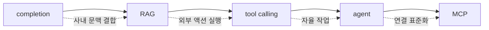

# 스터디 1회차 공동 발표자 노트

> 스터디 1회차 · 2026-05-30 · 정리 kodayoung \
> 발표자: 성희, 승주 \
> 본인 발표: [ai-history.md](./ai-history.md) \
> 본 문서는 동료 발표자 두 명의 발표를 정리하고, Backend/운영 관점에서 짧게 보완한 노트다. 발표자가 직접 언급하지 않은 수치·벤치마크는 추가하지 않았으며, 모델 포지셔닝 관련 내용은 **발표자 시점의 주장**으로 표시했다.

## TL;DR

- **성희**: 개발자의 AI 활용은 "답변하는 AI → 실행하는 AI"로 이동 중이다. 발전 축은 `completion → RAG → tool calling → agent → MCP`이며, 사내 문맥을 어떻게 AI에 연결하느냐가 다음 과제다.
- **승주**: Vibe Coding의 한계(수동적 수용, 검증 부재)가 **에이전틱 엔지니어링**(Karpathy, Software 3.0)과 **하네스 엔지니어링**(에이전트 런타임 가드레일) 등장의 배경이다. 모델 다양화 시대의 핵심 역량은 **"AI 매니징"** 이다.
- **공통**: 두 발표 모두 "코드 생성"에서 끝나지 않고 **실행 → 검증 → 표준화**로 이어지는 단계로의 이동을 강조한다. 본인 발표(`ai-history.md`)의 결론(설계 + 검증 + AI 오케스트레이션)과 같은 방향으로 수렴한다.

## 목차

- [1️⃣ 성희 — AI 개발 트렌드: Copilot에서 Coding Agent까지](#1️⃣-성희--ai-개발-트렌드-copilot에서-coding-agent까지)
- [2️⃣ 승주 — Vibe Coding부터 하네스 엔지니어링까지](#2️⃣-승주--vibe-coding부터-하네스-엔지니어링까지)
- [3️⃣ 두 발표를 관통하는 흐름](#3️⃣-두-발표를-관통하는-흐름)
- [References / 용어 정리](#references--용어-정리)

 

## 1️⃣ 성희 — AI 개발 트렌드: Copilot에서 Coding Agent까지

**핵심 메시지: 개발자의 AI 활용은 "답변하는 AI"에서 "실행하는 AI"로 이동하고 있으며, 그 발전 축은 점점 사내 시스템·문맥과 깊게 결합되는 방향이다.**

### 발전 축

각 단계는 이전 단계의 한계를 해결하면서 등장했고, 누적적으로 쌓이는 구조다. completion이 사라지지 않은 채 그 위에 RAG가, 그 위에 tool calling이, 그 위에 agent가 얹힌다.

### 활용 방식 6단계

| 단계 | 발표자가 설명한 내용 | 한계 / 효과 | Backend·운영 관점 보완 |
| --- | --- | --- | --- |
| **1. Code Completion** | DTO, Mapper, SQL 초안 같은 패턴 코드 생성 | 반복 작업 감소, 탐색 비용 감소 / 사내 문맥 없음 | 코드 컨벤션·내부 라이브러리에 무지함. IDE 플러그인 수준의 자동완성은 양산이 쉽지만 품질은 모델·프롬프트에 종속 |
| **2. 코드/로그 이해** | 코드 실행 추적, NPE 분석, SQL 성능, 리팩토링 | 디버깅·이해 보조 | 로그 포맷이 정규화되어 있을수록 효과 큼. 비정형 로그는 여전히 사람 판단 필요 |
| **3. RAG** | 사내 문서를 Vector DB에 저장 → 관련 근거 검색 → 문맥 활용 응답 | 근거 기반 응답, 환각 감소 | trade-off: 인덱싱 운영 비용, 임베딩 모델 교체 시 재인덱싱, **사내 권한 모델과 Vector DB 접근 권한의 정합성** 확보가 어려움 |
| **4. Tool Calling** | 사용자의 자연어 → 사내 시스템 호출 | 자연어 → 실행 연결 | trade-off: 권한 분리(누가 호출한 것인가)·실패 처리·재시도 정책 필요. 자연어 → API 매핑의 신뢰성은 모델·스키마 품질에 직접 비례 |
| **5. Structured Output** | AI 응답을 정형 구조로 강제 → 후속 처리·AI-to-AI 기반 | 자동화 토대 | 스키마 위반 시 fallback 처리, 부분 결과 처리 전략 필요. 이 단계 없이는 agent 안정 운영 불가 |
| **6. Coding Agent** | 4·5 위에서 자율 작업 실행 | 작업 단위 자동화 | 실행 환경의 격리·롤백·관측 가능성이 미비하면 운영 사고로 직결 (→ 승주 발표의 하네스 엔지니어링과 연결) |
| **7. MCP** | JIRA·배포파이프라인 등 Tool 연결을 표준 프로토콜로 일관화 | 모든 Tool·사내 API 연결을 표준 방식으로 처리 | 표준화 자체는 의미 있으나, **합의된 운영 표준은 아직 진행 중**. 도입 시 어댑터 레이어를 사내 시스템에 두는 편이 락인 위험이 적음 |

> 참고: 발표에서는 6단계로 묶었지만 흐름상 Coding Agent와 MCP는 분리해서 보는 편이 운영 설계에 가깝다. Agent는 "누가 무엇을 실행하는가"의 문제, MCP는 "어떻게 표준 인터페이스로 연결하는가"의 문제다.

### 흐름의 본질

발표자가 정리한 한 줄: **코드 제안 → 문맥 검색 → 도구 호출 → 작업 검증**.

이 흐름은 단순히 기능이 추가된 것이 아니라, AI의 책임 범위가 **"제안"에서 "실행"으로 확장**되었음을 의미한다. 실행으로 확장된 순간부터는 권한·관측·검증이 필수가 된다.

### 마무리 — "AI 친화적 설계"의 의미

발표자가 마지막에 던진 "AI 친화적인 설계가 필요하다"는 명제를 운영 관점에서 풀면 다음과 같다.

- **사내 문서**: AI가 참조 가능한 위치·포맷에 일관되게 존재해야 함. 흩어진 위키, 비공개 슬랙, 비정형 PDF는 RAG 품질을 떨어뜨림.
- **API 명세**: OpenAPI·schema 기반으로 정형화되어 있어야 tool calling이 신뢰 가능해짐.
- **로그·이벤트**: 구조화 로그가 RAG·tool calling 양쪽 모두의 입력이 됨.
- **권한 모델**: 사람용 RBAC와 별개로, agent용 권한·감사 추적 모델이 필요.

즉, "AI 친화적 설계"는 마케팅 수사가 아니라 **컨텍스트·인터페이스·감사 가능성**을 미리 갖춰두는 시스템 설계 작업이다.

 

## 2️⃣ 승주 — Vibe Coding부터 하네스 엔지니어링까지

**핵심 메시지: Vibe Coding의 한계가 에이전틱·하네스 엔지니어링 등장의 배경이며, 모델이 다양화될수록 "어떻게 지시할 것인가"라는 AI 매니징 역량이 핵심이 된다.**

### 발표 목차

1. Vibe Coding 개요
2. 에이전틱 엔지니어링
3. 하네스 엔지니어링
4. 현재(2026.05) LLM 동향

### Vibe Coding의 문제와 발전

**Vibe Coding**은 자연어 프롬프트로 코드 생성을 요청하고 결과를 그대로 수용하는 **수동적 개발 방식**이다.

- 요구사항이 비합리적이어도 모델은 일단 코드를 생성한다.
- 빠르지만 검증이 부재해 완벽하지 않다.
- 해법: **AI를 사람처럼 대하자.** 설명하고, 원칙을 주고, 공통 표준을 만들자.

이 인식 전환에서 **에이전틱 엔지니어링**(원칙·자율성)과 **하네스 엔지니어링**(가드레일·표준화)이 등장한다.

### 세 가지 패러다임 비교

| 구분 | Vibe Coding | 에이전틱 엔지니어링 | 하네스 엔지니어링 |
| --- | --- | --- | --- |
| **태도** | 결과 수용 (수동) | 시스템 설계 후 AI가 구현 가속 (능동) | 에이전트 실행 환경을 통제 |
| **단위** | 프롬프트 단위 | 작업·기능 단위 | 파이프라인·런타임 단위 |
| **출처/계보** | — | Karpathy 제안 (Software 3.0 맥락) | "4번째 AI 공학 패러다임" (발표자 표현) |
| **자동화 대상** | 코드 한 조각 | 계획 / 실행 / 디버그 전체 | 테스트·보안·코드리뷰·배포 가드레일 |
| **주요 리스크** | 검증 부재로 인한 잘못된 코드 채택 | 자율 실행 시 책임 소재 모호 | 가드레일 설계 누락 시 사고가 자동으로 확산됨 |

> 참고: "4번째 AI 공학 패러다임"이라는 표현은 발표자의 정리이며, 업계 합의된 분류는 아니다. 다만 **에이전트 런타임에 검증·보안·배포 정책을 자동으로 적용하는 스캐폴딩 구조**라는 개념 자체는 운영 관점에서 타당한 방향이다 (ai-history.md 4장의 Permission·Observability와 동일 문제의식).

### 2026.05 LLM 동향 — 발표자 시점의 모델 포지셔닝

> 아래 표는 **발표자가 제시한 모델별 포지셔닝 요약**이며, 공식 벤치마크나 검증된 비교가 아니다. 모델 라인업·강점 주장은 벤더 마케팅과 분리해서 봐야 한다.

| 모델 | 발표자가 강조한 특징 |
| --- | --- |
| **GPT-5.5** | 할루시네이션 감소, 에이전트 작업 강점 |
| **Claude Opus** | 멀티파일 코드 추론, 복잡한 코드, 장문 추론 |
| **Gemini 3.5 Flash** | Gemini 3.1 Pro 대비 4배 빠름, 멀티모달, 비용 효율 |
| **DeepSeek V4-Flash** | 저렴한 출력 비용 |
| **Gemini Spark** | 일상 자동화 / 퍼스널 에이전트 / 개인 업무 자동화 |
| **Kimi 2.6** | (발표에서 짧게 언급 후 넘어감) |

### LLM 선택 가이드 — 발표자 권장

| 작업 유형 | 추천 모델 | 선택 근거 (발표자 기준) |
| --- | --- | --- |
| 복잡한 코딩 / 멀티파일 | **Claude Opus** | 멀티파일 추론·장문 처리 강점 |
| 에이전트 / 터미널 작업 | **GPT-5.5** | 에이전트 작업 강점 |
| 멀티모달 + 저비용 | **Gemini 3.1 Pro** | 멀티모달 + 비용 균형 |
| 일상 개인 자동화 | **Gemini Spark** | 퍼스널 에이전트 포지션 |
| 비용 최우선 | **DeepSeek** | 출력 비용 최소화 |
| 오픈소스 / 자체 서빙 | **Kimi K2.6 / Llama4** | 자체 호스팅 가능성 |

> 운영 관점 보완: 모델 선택은 단순 강점 매핑으로 끝나지 않는다. **레이턴시 SLA, 데이터 전송 정책, 벤더 락인 회피, 동일 작업을 두 모델로 교차 검증할지 여부**가 실제 운영 비용을 결정한다. 단일 모델 의존은 모델 정책 변경(가격·deprecation) 시 즉시 리스크가 된다.

### 마무리 — "AI 매니징 역량"

발표자가 강조한 결론: **모델의 다양성에 맞춰, 어떻게 지시할 것인가가 중요하다.**

이를 풀어 보면 다음과 같다.

- **모델별 강·약점 매핑**: 같은 작업을 어떤 모델에 맡길지 결정 가능한 사전 지식
- **작업 분배 설계**: 복잡 추론은 Opus, 단순·대량 호출은 저비용 모델, 검증 단계 분리 등
- **프롬프트·컨텍스트 표준화**: 사람마다 결과가 달라지지 않도록 팀 단위 컨벤션
- **결과 검증 루프**: 모델이 바뀌어도 동작이 보장되는 평가셋(eval) 운영

이 모든 항목은 본인 발표(`ai-history.md`) 4장의 **Context·Validation·Permission·Orchestration·Observability** 5요소와 직접 맞닿는다.

 

## 3️⃣ 두 발표를 관통하는 흐름

성희와 승주의 발표는 표면적 주제는 다르지만, 동일한 구조적 결론으로 수렴한다.

| 관점 | 성희 | 승주 | 본인 발표(ai-history.md) |
| --- | --- | --- | --- |
| 진단 | 답변하는 AI → 실행하는 AI | Vibe Coding의 검증 부재 | "직접 구현" → "설계+검증" |
| 해법 방향 | 사내 문맥·도구를 표준 연결 (MCP) | 에이전트 런타임 가드레일 (하네스) | Context·Validation·Permission·Orchestration·Observability |
| 개발자 역할 | AI 친화적 설계자 | AI 매니저 | 시스템 오케스트레이터 |

세 발표는 같은 명제의 다른 측면이다.

> **AI의 능력이 "제안"에서 "실행"으로 확장될수록, 개발자의 역할은 "구현"에서 "실행 가능 환경의 설계와 검증"으로 이동한다.**

1회차 세션의 전체 메시지는 이 한 문장으로 압축할 수 있다.

 

## References / 용어 정리

- **RAG (Retrieval-Augmented Generation)**: 외부 지식 베이스에서 관련 문서를 검색해 LLM 응답에 근거를 제공하는 방식. (Lewis et al., 2020)
- **Tool Calling**: LLM이 정의된 함수/API를 호출 인자와 함께 반환하도록 하는 기능. 자연어 → 시스템 액션 연결의 기본 단위.
- **Structured Output**: LLM 응답을 JSON 등 정해진 스키마로 강제 출력하는 기능. AI-to-AI 파이프라인의 전제.
- **MCP (Model Context Protocol)**: 클라이언트(에이전트)와 외부 도구·데이터 소스 간 연결을 표준화하는 프로토콜. Anthropic 주도로 공개됨. 표준 채택은 진행 중.
- **Coding Agent**: 계획·실행·디버그를 자율 수행하는 AI 에이전트.
- **Vibe Coding**: 자연어 프롬프트로 코드 생성을 요청하고 결과를 그대로 수용하는 수동적 개발 방식. 용어 자체는 비공식.
- **에이전틱 엔지니어링 (Agentic Engineering)**: 시스템 설계 후 AI 에이전트가 구현을 가속하는 능동적 개발 방식. Karpathy의 Software 3.0 맥락에서 자주 언급됨.
- **하네스 엔지니어링 (Harness Engineering)**: AI 에이전트의 실행 환경(테스트·보안·리뷰·배포 가드레일)을 통제하는 스캐폴딩 구조.
- **Software 3.0**: Karpathy 제안. Software 1.0(수기 코드) → 2.0(학습된 신경망 weights) → 3.0(자연어/프롬프트가 프로그램이 되는 시대).
